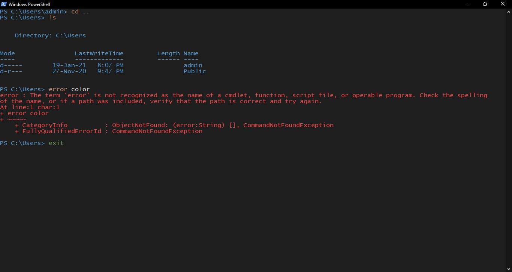

# PowerShell Hex Color


## Table of Contents
- [About](#about)
- [Prerequisites](#prerequisites)
- [Installation](#installation)
- [Usage](#usage)
- [Themes](#themes)

## About
Windows PowerShell is the strongest shell in the Windows Operating System and yet it is limited from customisation and colours due to its definite 16 colour values.

PowerShell Hex Color makes it easier to change the colours of the default color palette. Simply enter the Hex Value of the colour you want to add.

__Note: Script only works for PowerShell in Windows. Not even in PowerShell for Linux__


## Prerequisites
- Execution Policy for RemoteSigned PS Scripts must be enabled.
```powershell
Set-ExecutionPolicy RemoteSigned -Scope CurrentUser
```

- Rarely, if there's a security block when the script is downloaded, it has to be unblocked from the properties of the script.


## Installation


Windows Powershell:
```powershell
    iwr -useb https://raw.githubusercontent.com/GameGodS3/Powershell-Hex-Color/main/hexadjust.ps1 |`
     ni $HOME/Documents/WindowsPowerShell/hexadjust.ps1 -Force
```

OR

Simply download __hexadjust.ps1__ and save it in any folder of your liking. 


## Usage

You can run hexadjust.ps1 simply by double-clicking it's icon, or navigating to its folder in PowerShell and executing `.\hexadjust.ps1`. This will walk you through the interactive session to set the colors.

Additionally, (if you know the index value you wish to change and the color value) you could also directly set custom colors by simply passing it as an inline argument within PowerShell
```
.\hexadjust.ps1 -index [index number between 0 & 15] -colorvalue [hexvalue without the #]
```

## Themes (BETA)
Settings themes with Hex-Color is a feature in development.

Execute `hexadjust.ps1` and choose the 3rd option. Follow the prompt to set the custom color palette.

Once custom color palettes have been set, user will have to manually choose them in the `Properties > Color` menu of PowerShell.

1) CodeTheme

For this, once you have set the theme using hexadjust, go to `Properties > Color` and choose Background Color to be the 1st color, and foreground color to be the 10th color. Then execute `cls` and the color scheme must have gotten applied.



### Contributions are always welcome :)


---
###### Minor snippets of code borrowed from https://www.leeholmes.com/blog/2008/06/01/powershells-noble-blue/
