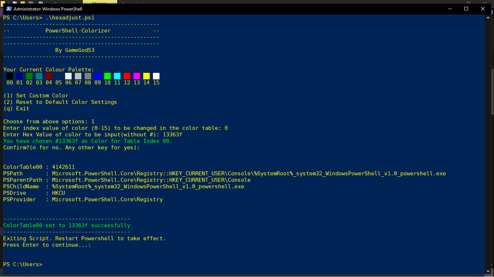
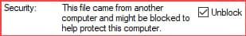

# PowerShell Colorizer

## Table of Contents
- [About](#about)
- [Prerequisites](#prerequisites)
- [Installation](#installation)

## About
Windows PowerShell is the strongest shell in the Windows Operating System and yet it is limited from customisation and colours due to its definite 16 colour values.

PowerShell Colorizer makes it easier to change the colours of the default color palette. Simply enter the Hex Value of the colour you want to add.

__Note: Script only works for PowerShell in Windows. Not even in PowerShell for Linux__



## Prerequisites
- Execution Policy for RemoteSigned PS Scripts must be enabled.
```powershell
Set-ExecutionPolicy -RemoteSigned -Scope CurrentUser
```

- Rarely, if there's a security block when the script is downloaded, it has to be unblocked from the properties of the script.



## Installation

Simply download __hexadjust.ps1__ and run it (by double clicking or by executing it within PowerShell)


---
###### Minor snippets of code borrowed from https://www.leeholmes.com/blog/2008/06/01/powershells-noble-blue/
